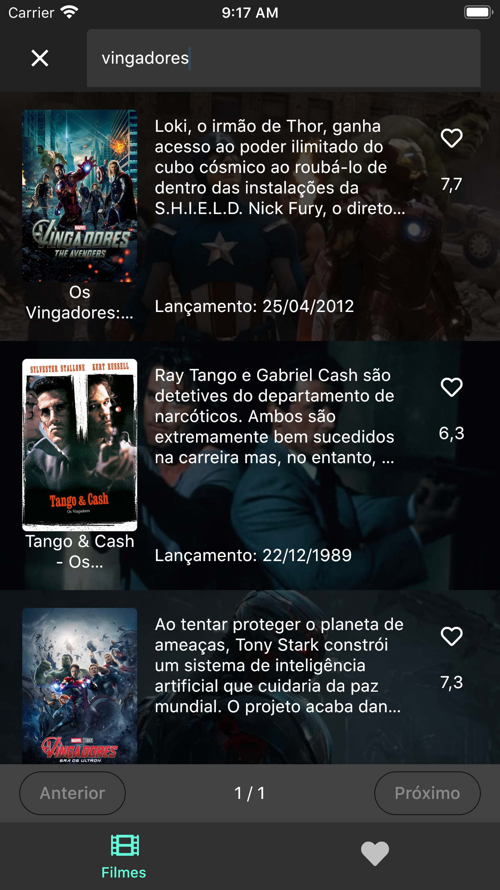

# Flutter Movie The Movie DB
Aplicação desenvolvida sob o framework flutter para consumir e exibir filmes da API The Movie Db

## Imagens





## Estrutura do Projeto

Com o objetivo de organizar e compor responsabilidades a cada repositório, o projeto
esta estruturado da seguinte forma:

- Bloc:
Diretório com as classes responsáveis pela camada lógica, gerenciamento de estado, que se comunica com a view e
seus respectivos repositorys.

- Enums:
Os enums são arquivos que configuram dados essências para a aplicação e são imutáveis.

- Library:
Constantes, arquivos de configuração e classes utéis são armazenadas nesse diretório.

- Model:
Os models são classes com propriedades específicas de um determinado objeto. Essas classes
possuem métodos essências para mapear o retorno de dados da API, por exemplo.

- Repository:
Nesse diretório estão os arquivos do tipo service que fazem comunicação com serviços externos ou alguma base de dados.

- Screen:
O diretório Screen compõe os Widgets responsáveis pelas telas da aplicação. o sufixo _screen define que
o Widget é uma tela, já o sufixo _tab define que o Widget é uma aba de uma tela específica, ou seja, uma subtela de uma screen.

- Tab:
O diretório Tab compõe os Widgets responsáveis pelas sub-telas da aplicação. Enquanto o sufixo _screen define que
o Widget é uma tela, o sufixo _tab define que o Widget é uma aba de uma tela específica, ou seja, uma sub-tela de uma determinada screen.

- Tile:
Os tiles são Widgtes reusáveis em screen, tab ou em outros Widgtes. Úteis para ser exibidos em uma lista, card, etc.

- Widget:
Nesse diretório estão os Widgets, os quais, podem ser utilizados/reusáveis em screen, tabs ou em outros Widgets.

## Plugin/Package
- Animated Text kit (2.2.0)

Um pacote que disponibiliza animações de texto

- BotToast (3.0.4)

Plugin para envio de alert, toast e notificação em tela

- Dio (3.0.10)

Cliente Http para Dart, que suporta interceptores, configuração global, FormData, cancelamento de solicitação, download de arquivo, tempo limite etc

- Intl (0.16.1)

Pacote com recursos essenciais para internacionalização e conversões de moeda, data, etc

- Font Awesome (8.8.1)

Disponibiliza ícones da galeria do site FontAwesome

- Jwt Decode (0.1.0)

Biblioteca com recursos para decodificar Jsonwebtokens

- Package Info: (0.4.1)

Permite acessar recursos quanto as informações da versão do aplicativo, app name e package name
  
- Provider (4.3.2)

Pacote que permite tornar Widgets reutilizáveis, aplicar injeção de dependência e gerenciar o estado da  aplicação
  
- RxDart (0.24.1)

RxDart adiciona recursos adicionais para Dart Streams e StreamControllers, permitindo gerenciar o estado, trabalhar com os conceitos de programação reativa e sob o padrão de projeto Observable

- Shared Preferences (0.5.8)

Plugin que permite ler e escrever pares de valores e chave de maneira simples

## Configuração

Baixe o SDK do [Flutter](https://flutter.dev/docs/get-started/install/windows) específico para o Windows e extraia o arquivo zip em um diretório do seu interesse. Exemplo: c:\src\flutter.

Após isso, adicione o caminho flutter/bin nas variáveis de ambiente e rode o comando:

```bash
flutter doctor
```
Observação: Não instale o Flutter em um diretório que exija privilégios.

[Flutter Release](https://flutter.dev/docs/development/tools/sdk/releases)

[Flutter Tutorial](https://flutter.dev/docs/cookbook)

## Building

Obtenha a lista de packages

```bash
flutter pub get
```

Execute em dispositivo ou emulador
```bash
flutter run
```

## Copyright ©

[Christiano Santana](https://www.linkedin.com/in/christiano-santana-7b090628)
